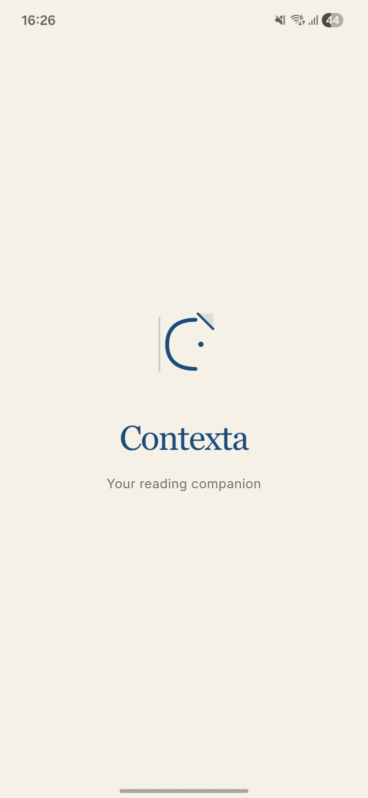
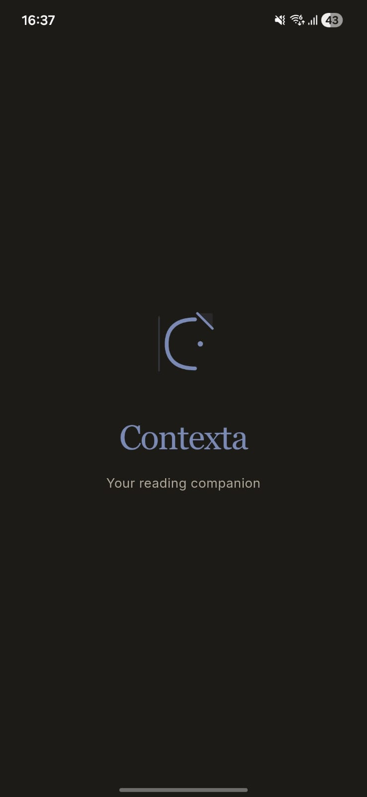
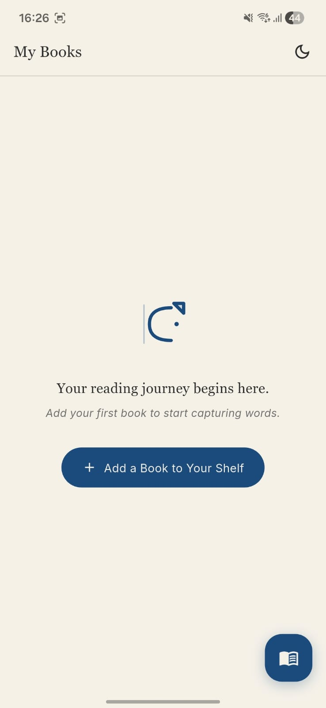
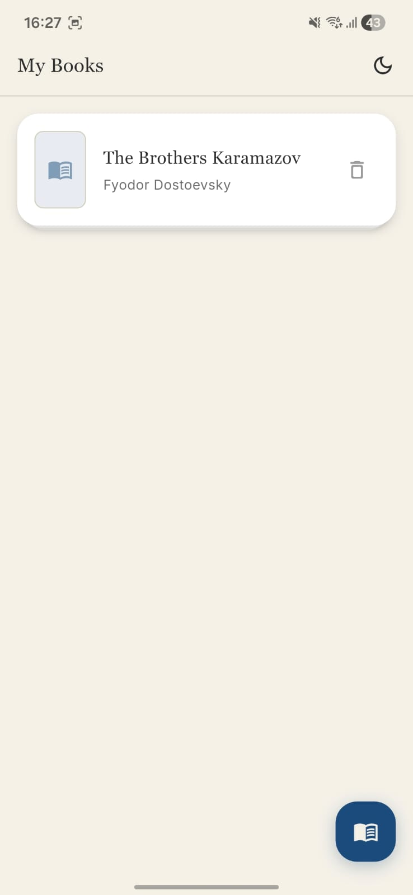
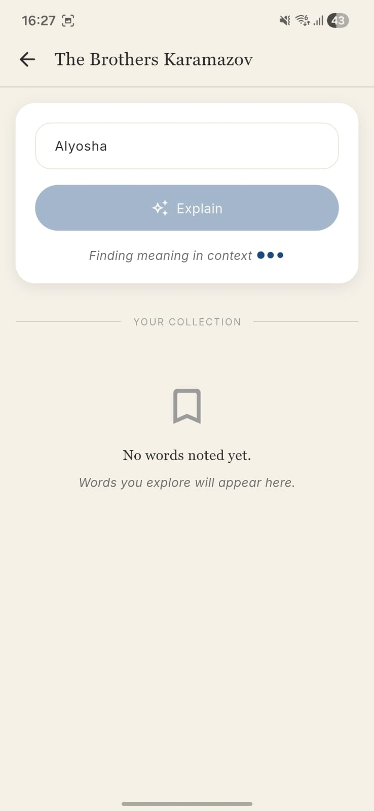
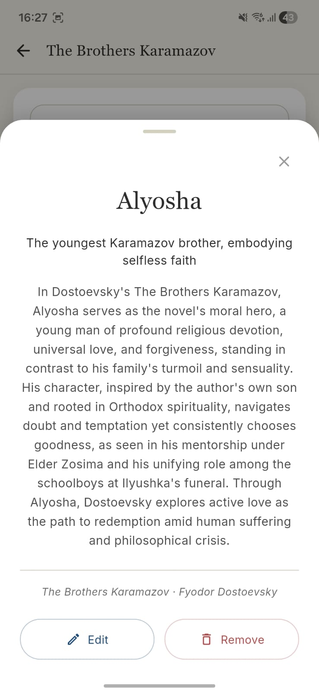
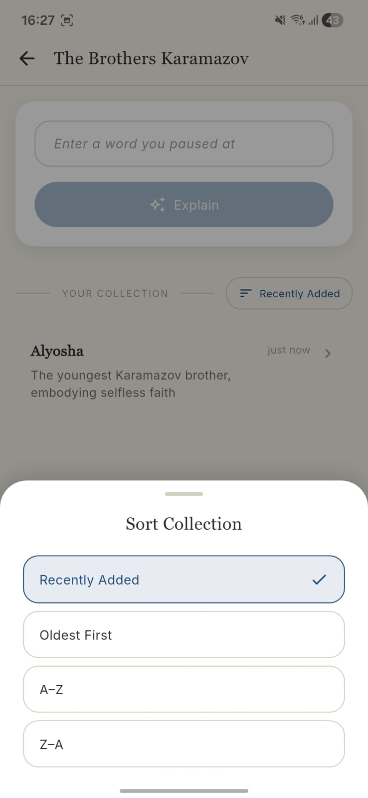
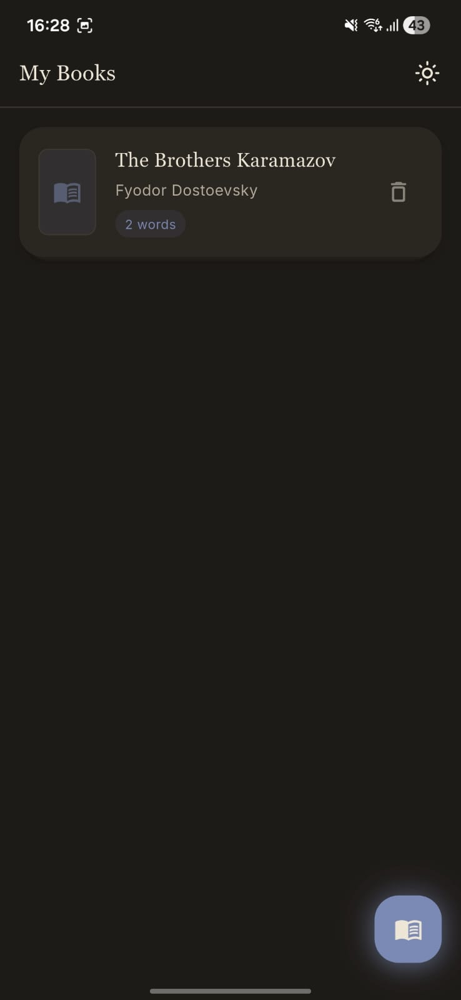

# Contexta

<p align="center">
  
</p>

<p align="center">
  <strong>A minimalist reading companion for curious minds</strong>
</p>

<p align="center">
  <a href="#features">Features</a> •
  <a href="#screenshots">Screenshots</a> •
  <a href="#installation">Installation</a> •
  <a href="#build">Build</a> •
  <a href="#architecture">Architecture</a> •
  <a href="#design-system">Design System</a>
</p>

---

## Overview

**Contexta** is a thoughtful, minimalist Flutter application designed for readers who encounter unfamiliar words while reading physical or digital books. Unlike traditional dictionary apps, Contexta provides **contextual explanations** — understanding words within the literary context of the book you're reading.

### The Problem

When reading challenging literature, encountering an unfamiliar word breaks the flow. Traditional dictionaries provide generic definitions that often miss the nuanced meaning the author intended.

### The Solution

Contexta leverages AI (Perplexity API) to explain words in the context of your current book, providing:
- A **short definition** (4-5 words)
- A **contextual explanation** considering the book's themes, genre, and author's style

---

## Features

### 📚 Personal Library (v1.0.0)
- **Add books** you're currently reading with title and author
- **Visual book cards** with stacked paper effect and subtle animations
- **Persistent storage** across app sessions via SharedPreferences
- **Empty state** with branded illustration and CTA
- **Book management** - delete books with smooth animations
- **Stacked paper effect** - realistic layered card appearance

**Use Case:** Build your personal reading collection without internet connectivity

### 🔍 Contextual Word Explanations (v1.0.0)
- **AI-powered explanations** using Perplexity's `sonar` model
- **Book-aware context** - explains words based on book title, author, and genre
- **Two-part format** - short definition (4-5 words) + detailed explanation (2-3 sentences)
- **Smart response handling** - automatically extracts structured responses
- **Error handling** - graceful fallback when API is unavailable
- **Timeout protection** - 30-second request timeout to prevent hanging

**Use Case:** Understand challenging vocabulary in literary context without breaking reading flow
**Example:** Instead of "love: affection", get: "In *The Brothers Karamazov*, love transcends romance—it's Father Zosima's imperative of *active love*, deliberately embracing neighbors amid suffering."

### 📝 Word Collection Management (v1.0.0)
- **Save explained words** to each book permanently
- **View collections** organized per book
- **Edit words** and refetch explanations with updated context
- **Remove words** with haptic feedback confirmation
- **Multiple sort options** - Recent, Oldest, A-Z, Z-A
- **Word metadata** - timestamp, relative time ("2h ago"), formatted dates
- **Bulk operations** - manage large word collections efficiently

**Use Case:** Build a personalized vocabulary glossary for each book; study before book discussions or exams

### ⚡ Offline-First Word Explanations (v1.1.0)
- **Local caching** - store explanations on device for instant retrieval
- **Search across cached words** - query previously explained words without API
- **Reduced API usage** - reuse cached explanations to save costs
- **Sync-on-demand** - refresh explanations only when explicitly requested
- **Database persistence** - SQLite-based storage for reliability

**Use Case:** Reference previously learned words without internet connection or API rate limiting

### 🎯 Context-Aware Rephrasing Levels (v1.1.0)
- **Three explanation tiers:**
  - **Simple** - Basic definition and one-sentence explanation
  - **Intermediate** - Standard explanation (default)
  - **Advanced** - In-depth analysis with literary references and context

- **Toggle between levels** - switch explanation complexity on the fly
- **Temperature control** - Simple (0.2) for focused responses, Advanced (0.5) for creative analysis
- **Progressive learning** - start simple and dig deeper as needed

**Use Case:** Match explanation depth to your reading difficulty and learning pace

### 📊 Word Frequency Per Book (v1.2.0)
- **Track word occurrences** - see how many times you explained each word
- **Frequency badges** - visual indicators (1, 2, 3+ times)
- **Identify patterns** - discover which words appear repeatedly across books
- **Learning insights** - words you encounter multiple times might be worth memorizing
- **Color-coded frequency** - green (rare), yellow (occasional), red (frequent)

**Use Case:** Identify and focus on recurring challenging vocabulary in your reading

### 🏷️ Difficulty Reason Tags (v1.3.0)
- **Seven difficulty categories:**
  - **Archaic** - Old-fashioned or obsolete words
  - **Technical** - Subject-specific terminology
  - **Figurative** - Idioms, metaphors, symbolism
  - **Cultural** - Culture or region-specific references
  - **Contextual** - Meaning depends on surrounding text
  - **Pronunciation** - Difficult to pronounce words
  - **Other** - Miscellaneous

- **Auto-tagged explanations** - AI analyzes why a word is difficult
- **Filter by reason** - find all archaic words or technical terms separately
- **Visual indicators** - quick identification of difficulty sources

**Use Case:** Understand *why* a word is challenging; learn similar types of difficult words together

### 🔎 Global Search Across Books (v1.4.0)
- **Full-text search** across all words in all books
- **Instant results** - filter as you type
- **Search metadata** - displays book title, timestamp, frequency count
- **Quick navigation** - tap search result to view full explanation
- **No API calls** - searches local cached data for speed

**Use Case:** Find words you've previously learned across your entire library; review vocabulary quickly

### 📤 Export Words (v1.5.0)
- **Multiple export formats:**
  - **CSV** - for spreadsheets and study apps (word, explanation, book, date)
  - **JSON** - for backup and data portability
  - **Markdown** - formatted for note-taking apps

- **Selective export** - choose specific book or all words
- **Share-friendly** - copy to clipboard or email exports
- **Rich formatting** - preserve explanations and metadata
- **Import-ready** - exports can be imported into Anki, Quizlet, notion, etc.

**Use Case:** Create flashcard decks in Anki/Quizlet, backup your word collection, share with study groups

### 🔥 Reading Streak (v1.6.0)
- **Motivation tracking** - maintain daily reading consistency
- **Streak counter** - consecutive days looking up words
- **Max streak display** - shows your best streak ever
- **Visual celebration** - badge animation at milestones
- **Timezone awareness** - counts based on local date/time
- **Streak reset prevention** - one grace day before streak breaks

**Use Case:** Gamify your reading habit; stay motivated to engage with challenging books daily

### 💬 Quote Capture (v1.7.0)
- **Capture meaningful quotes** while looking up words
- **Associated with books** - quotes are organized per book
- **Searchable collection** - find quotes across all books
- **Edit and organize** - modify captured quotes anytime
- **Share-ready** - formatted for social media or note-taking
- **Highlights importance** - mark passages that resonate with you

**Use Case:** Build a personal collection of memorable passages; create quote journals organized by book

### 🌓 Dark Mode Refinement (v1.8.0)
- **Automatic system detection** - respects device theme settings
- **Manual toggle** - switch between light/dark anytime
- **Warm color palette** - brown-based dark theme to reduce eye strain
- **Sophisticated shadows** - contextual shadow system for dark mode
- **Consistent branding** - warm ink blue accent in both modes
- **Theme persistence** - remembers user preference

**Use Case:** Comfortable reading at any time; reduce eye strain during nighttime reading sessions

**Light Mode Colors:**
- Background: Warm beige (#F5F1E8)
- Accent: Ink Blue (#1A4B7C)
- Text: Charcoal (#2D2D2D)

**Dark Mode Colors:**
- Background: Deep brown-black (#1E1B18)
- Accent: Light Ink Blue (#7B8AB5)
- Text: Warm off-white (#EDE6D8)

### 📖 Shelf Interaction (v1.9.0)
- **Premium spatial ritual** - transforms book addition into an intentional experience
- **Shelf opening animation** - shelf expands from top (160ms easeOutCubic)
- **Real-time preview card** - see book appear in form as you type title
- **Flying book animation** - book flies from form to library (440ms)
- **Arc trajectory** - -50px parabolic offset for authentic movement
- **Scale phases** - lift (1.0→1.05), travel (1.05→0.96), settle (0.96→1.0)
- **Shadow elevation** - dynamic elevation tracking book height during flight
- **Highlight glow** - newly placed books glow for 1 second (25% opacity)
- **Auto-scroll** - automatically scrolls to show newly added book
- **Haptic feedback** - lightImpact on open, selectionClick on settle

**Use Case:** Make adding books feel intentional and premium; create a satisfying ritual around building your library

**Animation Breakdown:**
- Shelf Opens: 160ms (responsive, snappy)
- Content Reveals: 60ms delay → 100ms fade (staggered)
- Book Flies: 440ms with -50px arc (authentic trajectory)
- Highlight Glows: 250ms in → 350ms hold → 400ms out

### ☁️ Ownership, Backup & Restore (v1.12.0) ⭐ **Latest**
- **User-first data ownership** - choose local-only or cloud backup at first launch
- **Google Sign-In integration** - secure authentication via Firebase Auth
- **Automatic cloud backup** - debounced 3-second backup on every change
- **Background backup** - triggers when app goes to background
- **Cross-device restore** - seamlessly restore library on new devices
- **Conflict resolution** - clear choice when both local and cloud have data
- **Local export option** - `.ctxb` file export for users who prefer no accounts
- **Settings integration** - manage backup from Settings → Library backup
- **No forced accounts** - local users treated with equal respect
- **Calm, Apple-style UX** - no fear messaging or pressure tactics

**Use Case:** Never lose your reading progress; sync your library across devices; maintain full control of your data

**What Gets Backed Up:**
- All books and their metadata
- All word explanations and collections
- Reading streak history
- User preferences (theme, explanation level, etc.)
- Quotes captured from books

**First Launch Flow:**
- "Keep It Here" - stays on device only
- "Sync Across Devices" - sign in with Google for cloud backup
- "You can change this later in Settings"

---

## Feature Roadmap & Versions

| Version | Feature | Release Date | Status |
|---------|---------|--------------|--------|
| v1.0.0 | Core Library, Word Explanations, Collections, Theme System | Q4 2025 | ✅ Stable |
| v1.1.0 | Offline Caching, Rephrasing Levels | Q4 2025 | ✅ Stable |
| v1.2.0 | Word Frequency Tracking | Q4 2025 | ✅ Stable |
| v1.3.0 | Difficulty Tags | Q1 2026 | ✅ Stable |
| v1.4.0 | Global Search | Q1 2026 | ✅ Stable |
| v1.5.0 | Export (CSV/JSON/Markdown) | Q1 2026 | ✅ Stable |
| v1.6.0 | Reading Streak | Q1 2026 | ✅ Stable |
| v1.7.0 | Quote Capture | Q1 2026 | ✅ Stable |
| v1.8.0 | Dark Mode Refinement | Q1 2026 | ✅ Stable |
| v1.9.0 | Shelf Interaction (Premium UX) | Jan 2026 | ✅ Stable |
| v1.10.0 | Gentle Suggestions | Jan 2026 | ✅ Stable |
| v1.11.0 | Book Suggestions | Jan 2026 | ✅ Stable |
| v1.12.0 | Ownership, Backup & Restore | Feb 2026 | ✅ Latest |

---

### How to Use

#### Adding Books (v1.9.0 Shelf Interaction)

1. **Open the Shelf**
   - Tap the "+" button (FAB) on the library screen
   - The shelf opens from the top with a smooth animation

2. **Add Book Details**
   - Enter the book **title** (required)
   - Enter the **author** (optional)
   - Watch the preview card appear in real-time

3. **Place on Shelf**
   - Tap "Place on Shelf" button
   - Book flies from the form to your library with an arc trajectory
   - Book lands with a settle animation and glows for 1 second
   - App auto-scrolls to show your new book

#### Looking Up Words

1. **Open a Book**
   - Tap on a book card from the library
   - Opens the book detail screen

2. **Enter a Word**
   - Type any unfamiliar word you encountered while reading
   - Tap "Explain" to get the contextual meaning
   - Choose explanation level (Simple/Intermediate/Advanced)
   - Word is automatically saved to collection

3. **View & Manage Words**
   - All explained words are saved under each book
   - Tap any word to see its full explanation again
   - View frequency count (1x, 2x, 3x+), difficulty reason, and capture date
   - Use "Edit" to modify the word and get a new explanation
   - Use "Remove" to delete words you no longer need

#### Searching Words (v1.4.0)

1. **Open Global Search**
   - Tap search icon in app bar
   - Search across all words in all books instantly

2. **Filter Results**
   - Search displays book, frequency, and date
   - Results are sorted by relevance
   - Tap result to view full explanation

#### Exporting & Sharing (v1.5.0)

1. **Export Your Collection**
   - Tap menu → "Export Words"
   - Choose format: CSV, JSON, or Markdown
   - Select book or export all
   - Share or save to device

2. **Use for Studying**
   - Import CSV into Anki, Quizlet, or Notion
   - Use JSON for data portability
   - Share Markdown with study groups

#### Building Reading Streaks (v1.6.0)

1. **Look Up One Word Daily**
   - Maintain consistency by explaining words each day
   - Streak counter appears on library screen
   - One grace day if you miss a day

2. **Track Milestones**
   - 7-day streak: You're on fire! 🔥
   - 30-day streak: Reading habit mastered! 📚
   - View max streak on profile

#### Capturing Quotes (v1.7.0)

1. **While Explaining Words**
   - Tap "Capture Quote" button
   - Select meaningful passage from book
   - Quote is saved with book association

2. **View Quote Collection**
   - View all quotes organized by book
   - Search across quote library
   - Edit or remove quotes anytime

#### Switching Themes

- Tap the **sun/moon icon** in the top-right corner
- App remembers your preference
- Automatic theme respects device settings (or manual override)

### What Makes Contexta Different?

Unlike traditional dictionaries that give generic definitions, Contexta understands **context**:

| Traditional Dictionary | Contexta |
|----------------------|----------|
| "Love: A strong feeling of affection" | "In *The Brothers Karamazov*, 'love' transcends romantic notions—it embodies Father Zosima's Christian imperative of **active love**, a deliberate effort to embrace neighbors amid suffering." |

### 💡 Pro Tips

- **Enter anything book-related** — Whether it's a word, phrase, character name, or concept from your book, Contexta will provide relevant context based on the book's themes and the author's style.

- **Be specific with book titles** — The more accurate your book title and author, the better the contextual explanation.

- **Use for challenging literature** — Contexta shines with classic literature, philosophy, and complex modern fiction where words carry deeper meaning.

- **Build your vocabulary** — Your word collection becomes a personal glossary for each book, perfect for revisiting before discussions or exams.

---

## Screenshots

<p align="center">
  
  
  
  
</p>

<p align="center">
  
  
  
  
</p>

---

## Installation

### Prerequisites
- Flutter SDK ^3.7.2
- Dart SDK ^3.7.2
- Android Studio / VS Code
- Perplexity API key

### Setup

1. **Clone the repository**
   ```bash
   git clone https://github.com/yourusername/contexta.git
   cd contexta
   ```

2. **Install dependencies**
   ```bash
   flutter pub get
   ```

3. **Configure API key**
   
   Create a `.env` file in the project root:
   ```env
   # Perplexity API Configuration
   # Get your API key from: https://www.perplexity.ai/settings/api
   PERPLEXITY_API_KEY=your_api_key_here
   ```

4. **Run the app**
   ```bash
   flutter run
   ```

---

## Build

### Android APK

```bash
# Build release APK (all ABIs)
flutter build apk --release

# Build split APKs (smaller size per architecture)
flutter build apk --release --split-per-abi
```

**Output:** `build/app/outputs/flutter-apk/app-release.apk`

### iOS

```bash
flutter build ios --release
```

### Web

```bash
flutter build web --release
```

### App Icons

To regenerate app icons after modifying the source:

```bash
# Generate icon source files
dart run tool/generate_app_icon.dart

# Apply to all platforms
dart run flutter_launcher_icons
```

---

## Architecture

### Project Structure

```
lib/
├── main.dart                 # App entry point, state management
├── config/
│   └── api_config.dart       # API configuration (keys, endpoints)
├── models/
│   ├── book.dart             # Book data model
│   └── word_entry.dart       # Word entry data model
├── screens/
│   ├── splash_screen.dart    # Animated splash with logo
│   ├── library_screen.dart   # Main library view with shelf overlay
│   ├── book_detail_screen.dart  # Book words & input
│   └── add_book_screen.dart  # [Deprecated] Add new book form (replaced by shelf)
├── services/
│   ├── perplexity_service.dart  # AI API integration
│   └── storage_service.dart     # Local persistence
├── theme/
│   └── app_theme.dart        # Design tokens & themes
└── widgets/
    ├── shelf_overlay.dart    # [NEW] Shelf animation system (v1.9.0)
    ├── add_book_panel.dart   # [NEW] Book entry form panel (v1.9.0)
    ├── book_card.dart        # Book display card
    ├── contexta_app_bar.dart # Custom app bar
    ├── contexta_bottom_sheet.dart  # Modal sheets
    ├── contexta_dialog.dart  # Confirmation dialogs
    ├── contexta_text_field.dart    # Styled inputs
    ├── loading_dots.dart     # Animated loader
    ├── logo.dart             # Brand logo widget
    ├── primary_button.dart   # Primary CTA button
    ├── secondary_button.dart # Secondary button
    ├── word_explanation_sheet.dart  # Word detail modal
    └── word_list_item.dart   # Word collection item
```

### State Management

The app uses **lifting state up** pattern with StatefulWidgets:
- Books list managed in `main.dart`
- Passed down to screens via constructor
- Callbacks bubble up state changes
- `StorageService` handles persistence

### Data Flow

```
User Action → Screen Widget → Callback to Main → 
State Update → StorageService.save() → UI Rebuild
```

### API Integration (v1.0.0)

**Perplexity API** is used for contextual word explanations:
- Model: `sonar` (fast, accurate)
- Max tokens: 300 (controls response length)
- Temperature: 0.3 (focused, less creative)
- Custom system prompt for literary context
- Timeout: 30 seconds

**Explanation Levels (v1.1.0):**
- **Simple** - Basic definition + simple explanation (Temperature: 0.2)
- **Intermediate** - Standard explanation (Temperature: 0.3) [Default]
- **Advanced** - In-depth analysis + literary references (Temperature: 0.5)

### Offline Architecture (v1.1.0)

- **Cache Layer** - SQLite database stores all explanations locally
- **Auto-Cache** - Every API response is saved automatically
- **Sync-on-Demand** - Manually refresh explanations when needed
- **Search** - Full-text search on cached data (no API calls)
- **Fallback** - If API fails, retrieve from cache automatically

### Word Tracking System (v1.2.0 + v1.3.0)

- **Frequency Counting** - Increments each time word is looked up
- **Difficulty Tags** - Auto-categorized by AI (7 categories)
- **Metadata** - Timestamp, book context, explanation level used
- **Visual Indicators** - Color-coded frequency badges and tag icons

### Export System (v1.5.0)

- **CSV Export** - Headers: word, short_definition, explanation, book, date, frequency, difficulty
- **JSON Export** - Structured data for portability and backup
- **Markdown Export** - Formatted for note-taking apps (Obsidian, Notion)
- **Selective Export** - Per-book or all-books options

### Reading Streak Engine (v1.6.0)

- **Daily Tracking** - Checks if word was explained today (timezone-aware)
- **Streak Counter** - Increments on consecutive days
- **Max Streak** - Tracks historical best streak
- **Grace Period** - Allows one missed day without breaking streak
- **Reset Logic** - Resets after 2+ consecutive days missed

### Quote System (v1.7.0)

- **Association** - Quotes linked to specific book
- **Searchable** - Full-text search across all quotes
- **Editable** - Modify quotes anytime
- **Export-ready** - Quotes included in word exports

### Animation System (v1.9.0)

**Shelf Overlay:**
- ShelfController: ChangeNotifier-based state management
- Two AnimationControllers: Shelf expansion + Book placement
- Dim overlay: 8% opacity background
- Flying book: Arc trajectory with shadow elevation
- Position tracking: GlobalKey for precise animation targets

**Component Architecture:**
- `ShelfOverlay` - Parent animation orchestrator (407 lines)
- `AddBookPanel` - Form UI with preview card (362 lines)
- `LibraryScreen` - Integration + highlight + scroll logic (572 lines)

---

## Design System

### Philosophy

Contexta's design follows a **"quiet luxury"** aesthetic — elegant, understated, and focused on content. The interface should feel like a well-crafted journal, not a tech product.

### Color Palette

#### Light Mode
| Token | Hex | Usage |
|-------|-----|-------|
| Background | `#F5F0E8` | Warm beige paper |
| Surface | `#FFFFFF` | Cards, sheets |
| Ink Blue | `#1A4B7C` | Primary accent |
| Text Primary | `#2D2D2D` | Main text |
| Text Secondary | `#6B6B6B` | Supporting text |
| Border | `#E5E0D8` | Subtle dividers |

#### Dark Mode
| Token | Hex | Usage |
|-------|-----|-------|
| Background | `#1A1A1A` | Deep charcoal |
| Surface | `#2A2A2A` | Elevated surfaces |
| Light Ink Blue | `#7B8AB5` | Primary accent |
| Text Primary | `#F5F0E8` | Main text |
| Text Secondary | `#A0A0A0` | Supporting text |
| Border | `#3A3A3A` | Subtle dividers |

### Typography

| Style | Font | Size | Weight | Usage |
|-------|------|------|--------|-------|
| Display | Georgia (Serif) | 28px | 500 | Screen titles |
| Headline | Georgia (Serif) | 24px | 500 | Section headers |
| Body | Inter | 16px | 400 | Main content |
| Caption | Inter | 14px | 400 | Secondary info |
| Button | Inter | 15px | 500 | Button labels |

### Spacing Scale

- `4px` - Micro spacing
- `8px` - Tight spacing
- `12px` - Compact spacing
- `16px` - Default spacing
- `24px` - Relaxed spacing
- `32px` - Section spacing
- `48px` - Large gaps

### Border Radius

- Small: `8px` - Buttons, inputs
- Medium: `12px` - Cards
- Large: `16px` - Sheets, modals
- XLarge: `24px` - Pills, FAB

### Animations & Timings

| Animation | Duration | Curve | Details |
|-----------|----------|-------|---------|
| Shelf Open | 160ms | easeOutCubic | Responsive shelf expansion |
| Content Reveal | 60ms delay + 100ms | easeOut | Staggered form appearance |
| Book Placement | 440ms | easeOutCubic | Flying book with arc trajectory |
| Book Arc | -50px amplitude | Parabolic | Visible parabolic flight path |
| Highlight Glow | 1000ms total | Sequence | 250ms fade-in, 350ms hold, 400ms fade-out |
| Fade In (Screens) | 700ms | easeOut | Screen transitions |
| Button Press | 100ms | easeOut | Tap feedback |
| Sheet Enter | 300ms | easeOut | Bottom sheets |
| Loading Dots | 600ms | easeInOut | API loading |

### Logo

The Contexta logo combines three elements:
1. **Page corner fold** (top-right) - Represents reading
2. **C-shaped bracket** - Annotation/marginalia symbol
3. **Margin line** (left) - Scholarly annotation style

Built with `CustomPaint` for crisp rendering at any size.

---

## Dependencies

```yaml
dependencies:
  flutter: sdk
  cupertino_icons: ^1.0.8         # iOS-style icons
  http: ^1.2.0                     # HTTP client for API
  shared_preferences: ^2.2.2       # Local storage
  flutter_dotenv: ^5.1.0           # Environment config
  sqflite: ^2.4.2                  # SQLite database
  path: ^1.9.1                     # Path utilities
  path_provider: ^2.1.5            # File system paths
  firebase_core: ^3.12.1           # Firebase core
  firebase_auth: ^5.5.2            # Firebase authentication
  cloud_firestore: ^5.6.6          # Firestore database
  google_sign_in: ^6.2.2           # Google authentication
  file_picker: ^8.3.7              # File picker for local export

dev_dependencies:
  flutter_test: sdk
  flutter_lints: ^5.0.0            # Linting rules
  flutter_launcher_icons: ^0.14.3  # Icon generation
  image: ^4.1.3                    # Image processing
```

---

## Configuration

### Environment Variables

| Variable | Description | Required |
|----------|-------------|----------|
| `PERPLEXITY_API_KEY` | API key for Perplexity AI | Yes |

### API Configuration

Located in `lib/config/api_config.dart`:

```dart
static const String perplexityModel = 'sonar';
static const int maxTokens = 300;
static const double temperature = 0.3;
static const Duration requestTimeout = Duration(seconds: 30);
```

---

## Contributing

1. Fork the repository
2. Create a feature branch (`git checkout -b feature/amazing-feature`)
3. Commit your changes (`git commit -m 'Add amazing feature'`)
4. Push to the branch (`git push origin feature/amazing-feature`)
5. Open a Pull Request

---

## License

This project is licensed under the MIT License - see the [LICENSE](LICENSE) file for details.

---

## Acknowledgments

- **Perplexity AI** for the contextual explanation API
- **Flutter Team** for the amazing framework
- Design inspiration from minimalist reading apps and physical journals

---

<p align="center">
  An initiative by jiteshh-10 — empowering curious readers 📚
</p>
